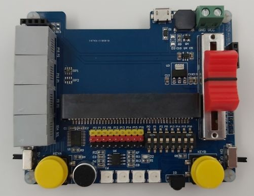

# KSB039 RJ11 Seneor Board

P0  Beep\
P1  Mic\
P2  Slider\
P13 Ultrasonic\
P14 IR Remote\
P16 RGB LED

## User Guide 

## Code Example 

## License

MIT

## Supported targets

* for PXT/microbit
(The metadata above is needed for package search.)

